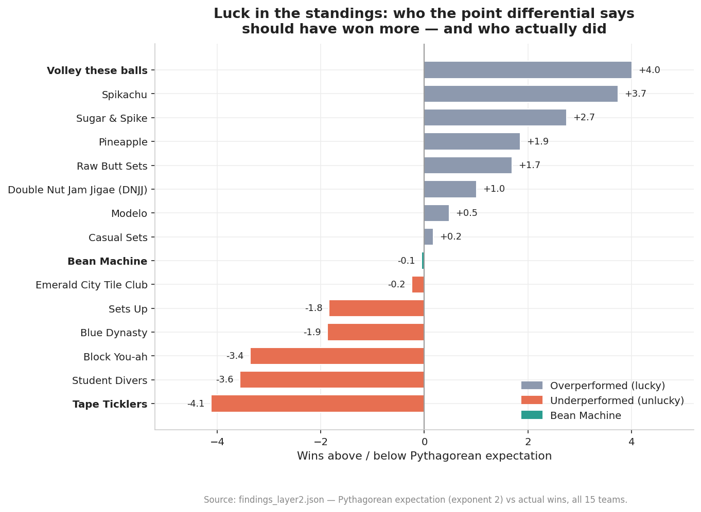
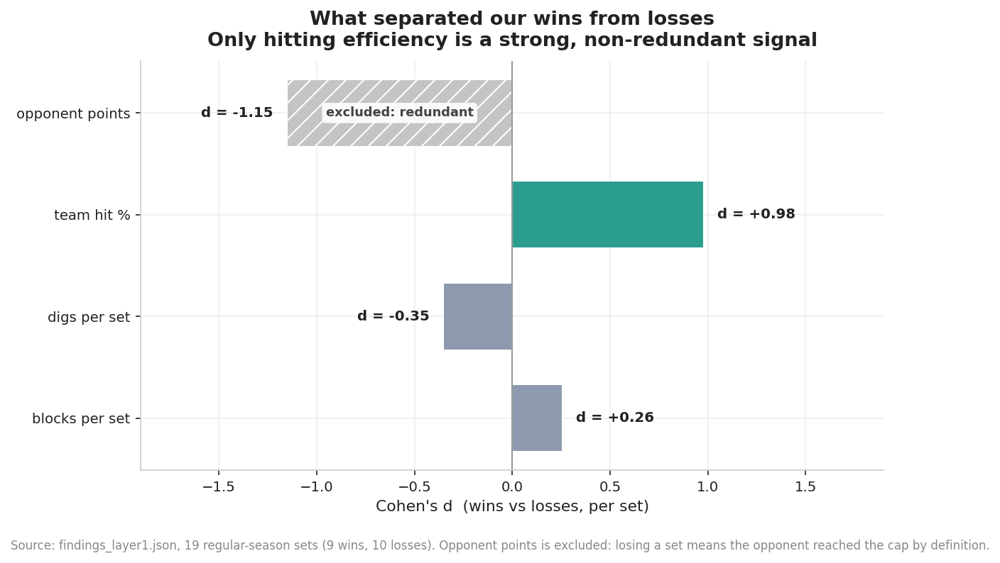
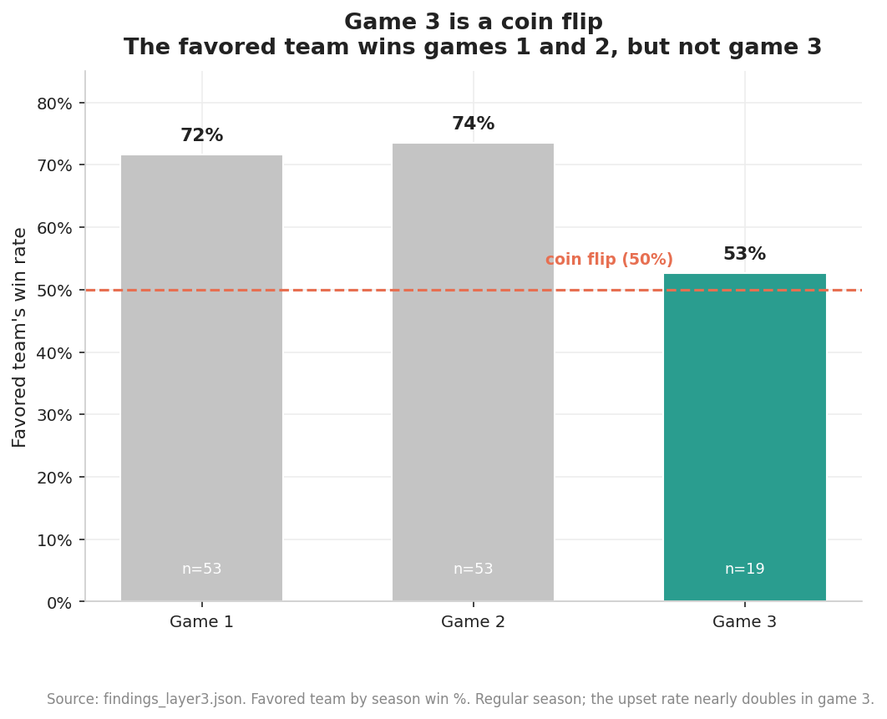
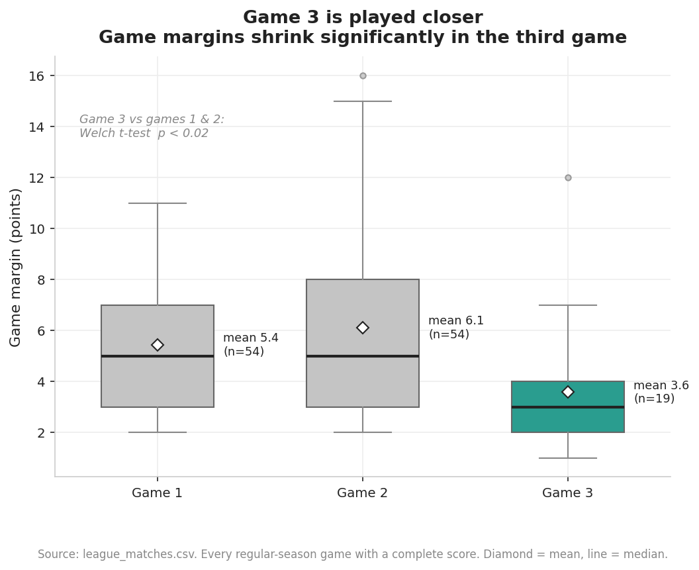
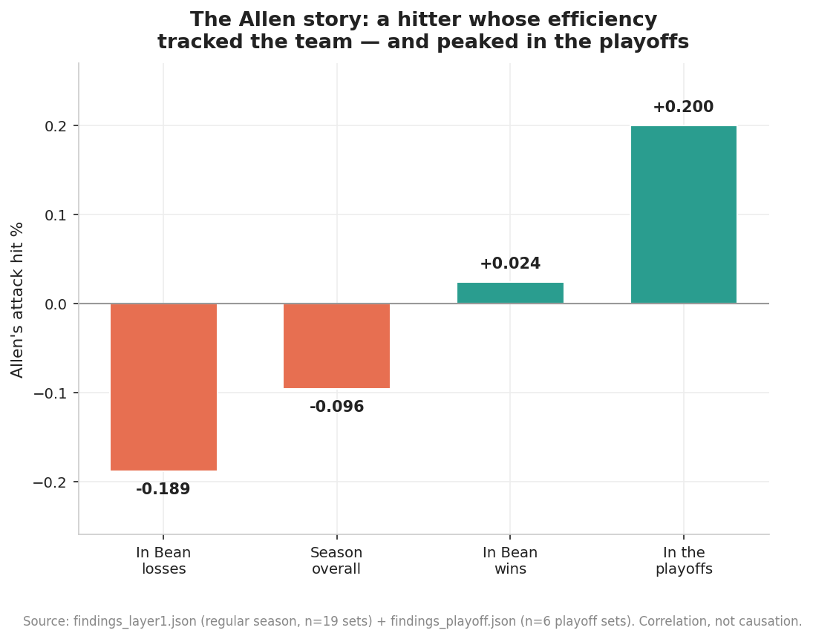
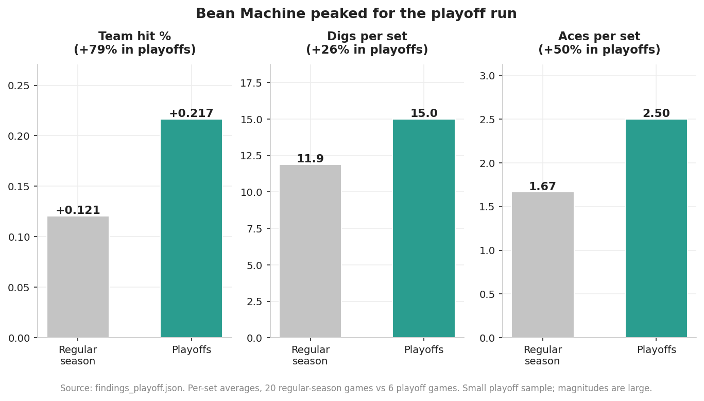
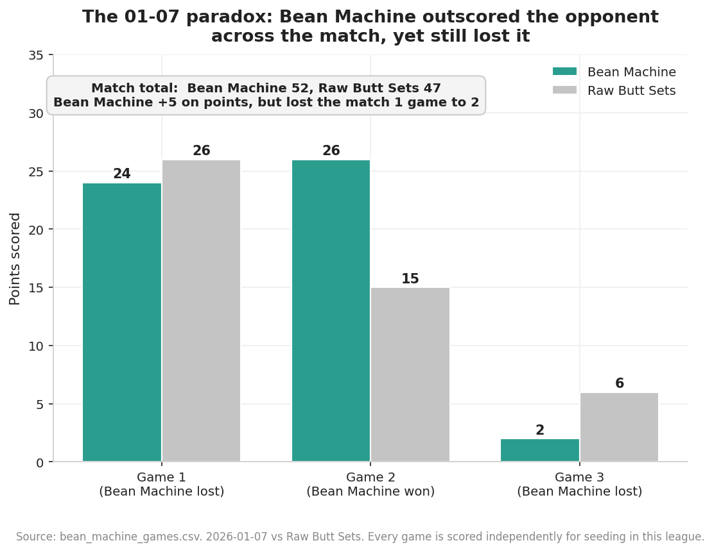
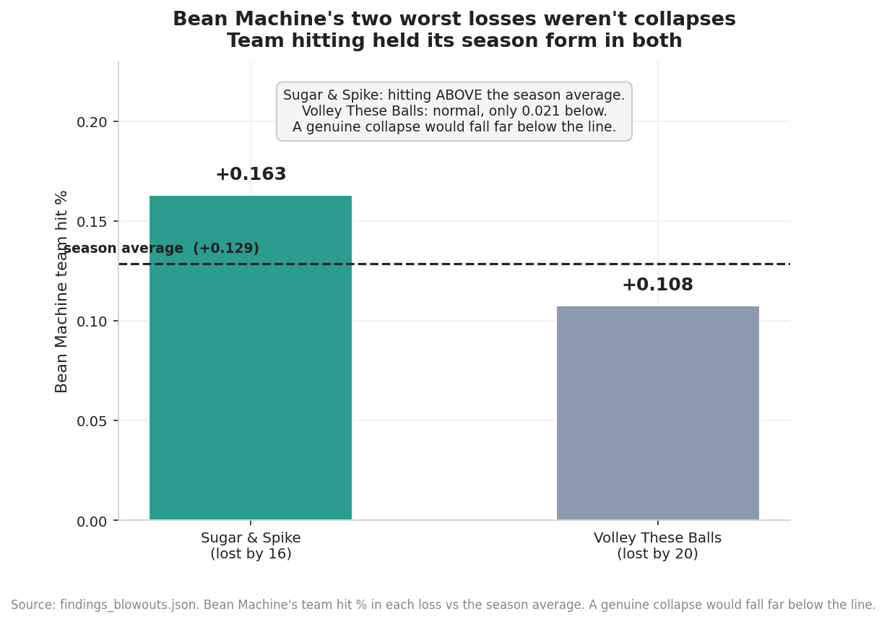
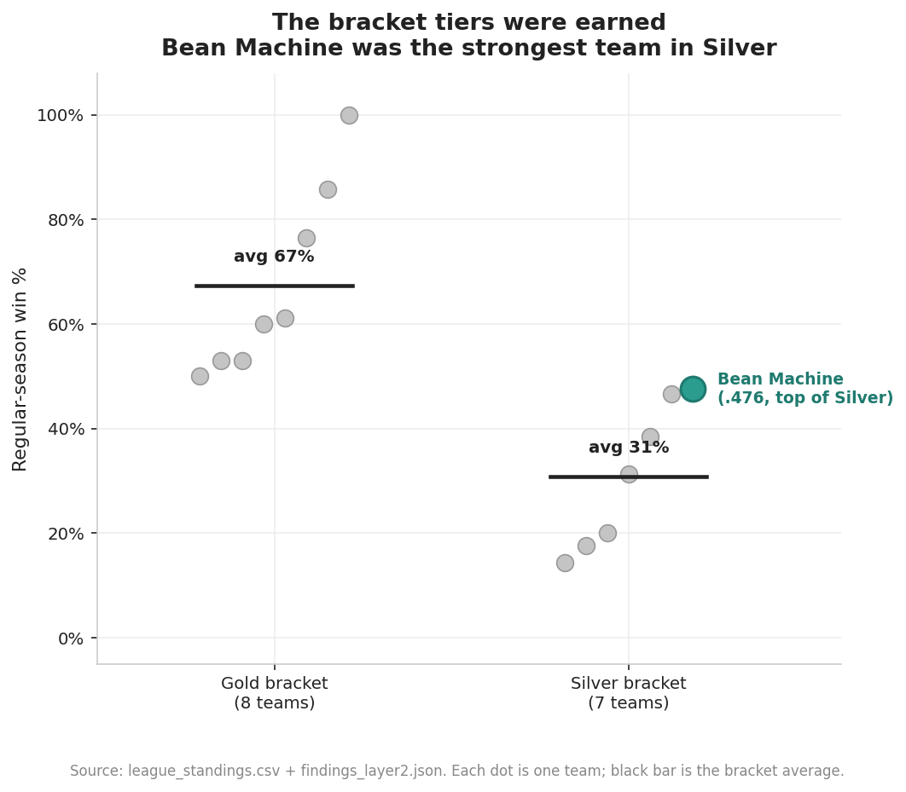

# Bean Machine: Why Did Our Volleyball Season Go the Way It Did?

A data analysis of my own volleyball team's 2025-26 season in a BB-level rec
league. I play on the team and tracked our player stats myself, by hand from
game footage. The raw data was messy and real.

**The team:** Bean Machine, team #11 in the Mercer Island Wednesday Men's
Volleyball League. **The season:** 10-11 in the regular season, #1 seed in the
Silver bracket, and Silver bracket champions.

To answer it, I built a reproducible pipeline that turns two spreadsheets into
clean data, a ranked set of findings, and the charts below.

---

## TL;DR

- **We earned our record.** A team with our point differential "should" have won
  ~10.05 games by Pythagorean expectation. We won 10. That −0.05 gap was the
  smallest in the 15-team league. Our .476 season was neither lucky nor unlucky.
- **Hitting efficiency decided our sets.** We hit +.197 in the sets we won versus
  +.049 in the sets we lost. It was the one factor that clearly separated winning
  from losing.
- **We peaked at exactly the right time.** We were a consistent team across the
  regular season, with no real improvement week to week, then team hitting
  efficiency jumped ~80% in the playoff run we went on to win.
- **The league's unusual format has a measurable quirk:** due to every set being
  scored independently, a third game gets played even when the match is decided,
  and **game 3 is basically a coin flip.**



---

## The project

I play on Bean Machine, and I kept our stats all season using Google Sheets.
Here the data is messy, real, and mine: I collected all of our player stats by
hand from game footage.

**The league format is unusual and it matters.** Fifteen teams. Each week, teams
play 3 games, or 6 if they have a double-header. But *every game counts
independently* toward seeding, and point differential is a tiebreaker. There's
no "win the match 2-0 and stop". Teams play the third game even when it can't
change who won, because the game itself still counts. That quirk turns out to be
one of the most interesting things in the data (see
[Game 3 is a coin flip](#3-game-3-is-a-coin-flip)).

---

## The roster

We ran a seven-player rotation all season. Everyone played nearly every game
available. Roles below are derived from the stats, not from the position field
(which changed game to game).

| Player | Role | The numbers |
|---|---|---|
| **Zane** | Setter | 138 assists (74% of the team's total); best server, 30% of team aces |
| **Jeremy** | Outside hitter | 58 kills, +.222 hit% |
| **Andy** | Outside hitter | 57 kills, +.203 hit%; a near-perfect mirror of Jeremy |
| **Cole** | Utility / defensive anchor | Team-high 61 digs; played seven different positions across the season |
| **Cade** | Middle / backup setter | 34 assists *and* 59 digs |
| **Allen** | Opposite hitter | 25 kills, but a team-high 32 errors (−.062 season hit%) |
| **Tae** | Middle blocker | Played all 20 of his games; missed the playoffs with an injury |

A closer look at each player:

**Zane.** Every possession ran through Zane. He recorded 138 assists, 74% of the
team's total, and barely touched the error column: one attack error all season.
He was also the team's most dangerous server, with a team-high 12 aces.

**Jeremy.** He led the team in kills (58) at the best efficiency of any
high-volume hitter (+.222 hit%), the most reliable point of attack.

**Andy.** His stat line is almost a carbon copy of Jeremy's: 57 kills, +.203
hit%. Bean's offense wasn't built around one star. It was two near-identical
outside hitters who could each carry the load.

**Cole.** He was the team's Swiss army knife. Over 26 games he lined up at
libero, all three outside-hitter spots, and all three middle spots: seven
distinct positions. He anchored the defense with a
team-high 61 digs. And when Tae went down injured before the playoffs, Cole
moved to the middle for the championship run. His hitting efficiency
dropped from +.229 in the regular season to +.045 in the playoffs as he
adjusted. Across the regular season our best game margins came with Cole at
libero, but with only six games there, it's a question, not a conclusion.

**Cade.** He led in blocks, with 21 (only Zane, with 17, was close; no one else
reached double digits). He was also the team's best passer (top serve-receive
average), second in digs, and second in assists as the backup setter.

**Allen.** He took a large share of the swings and his efficiency rose and fell
with the team's results all season, the clearest individual pattern in the data
(see [The Allen story](#4-the-allen-story)). A team-high 32 attack errors in the
regular season, then a sharp turnaround in the playoffs.

**Tae.** He played every one of the 20 games available to him in the regular
season, then missed the entire playoff run due to injury. His absence changed the
playoff lineup (see [We peaked for the playoffs](#5-we-peaked-for-the-playoffs)).

---

## The data and why it was the hard part

The analysis is only as good as the data under it, and the data started rough.
Two source spreadsheets:

- **`league_raw.xlsx`**: every team's schedule and scores. Scores were typed as
  free text by whoever was running the night, with no fixed format:
  `"11 win, 17-25, 25-20, 14-15"`, `"(8 win) 25-19, 25-15"`, `"11w,17-25,..."`,
  `"Tie: 25-20, 20-25"`, `"Both teams won 1 set, no time for third"`.
- **`player_stats_raw.xlsx`**: my own per-player, per-game tracking: attack,
  serving, blocking, digs, serve-receive grades, across ~26 per-game tabs.

**Phase 1 turns that into three clean, validated CSVs** via a five-step pipeline.
The parser is deliberately hybrid: regex reads roughly 85% of score cells that 
follow a recognizable pattern. Every cell it can't read confidently gets flagged 
to `data/manual_review/` for me to fix by hand, with its original text and a best 
guess attached. Nothing is silently dropped or quietly parsed wrong. A validation 
step then cross-checks every join key and reports coverage and discrepancies.

That honesty surfaced real things, all documented rather than hidden:

- Our official record of 10-11 and our on-court record  of 9-11 (from the Google Sheets),
  differ by one game. The league sheet did not record a third game, and the
  commissioner awarded us a win. Both views are kept in the data.
- One game (02-18 G3) has no player stats and never will. I don't have footage.
- A `match_id` key collision (two matches per court per week shared an ID) was
  caught during analysis and fixed.

Real franchise data looks like this. Handling it honestly is the point.

---

## Source data

The `.xlsx` files in `data/raw/` are exports of two Google Sheets maintained
through the season:

- League schedule and scores:
  [Google Sheet](https://docs.google.com/spreadsheets/d/1fUR2kJy3ZEeiIz9mfyUbWO2I-rPgxGcQ44nToddjqaE/edit?usp=sharing)
- Bean Machine per-player stats:
  [Google Sheet](https://docs.google.com/spreadsheets/d/1Mk5XCqo7_MVq0_m-4yvjRVieMh7UwWcEXsp1RCRQ-Oc/edit?usp=sharing)

Game footage (the source for the player stats) is on YouTube:
[@cadetanaka7543](https://www.youtube.com/@cadetanaka7543).

---

## What I found

Phase 2 computes findings across three "layers" — inside the team, the league
context, and the league-format hook — plus deep dives on the playoffs, season
trends, player roles, and the two worst losses. Every finding is scored on effect
size, **sample size** (small samples are scored down on purpose), and narrative
interest; the full ranked list is in
[`data/processed/findings_summary.md`](data/processed/findings_summary.md).

A blunt caveat up front: **the samples are small** — 19 regular-season sets with
complete data, 6 playoff sets, 7 weekly data points. These findings are honest
descriptions of what the data shows, not laws. Correlation is never causation.

### 1. We earned our record

Pythagorean expectation estimates how many games a team *should* win from its
point differential. Across the league it exposed some big gaps between luck and
merit — Volley These Balls went 11-0 on a profile worth ~7 wins (the luckiest
team), Tape Ticklers won 3 on a profile worth ~7 (the unluckiest).

Bean Machine? Expected 10.05, won 10. The smallest gap of any team. Our .476 was
exactly what our play deserved. (Chart at the top of this README.)

### 2. Hitting efficiency is what separated our wins from losses

I wanted to compare offense and defense head to head, but the data only honestly
supports half of that. Hitting efficiency cleanly separated our sets: we hit
+.197 in the sets we won versus +.049 in the sets we lost, a large effect
(Cohen's d = +0.98).

Defense is harder to pin down honestly. The obvious stat, opponent points per
set, is nearly tautological: if you lose a set the opponent reached the cap by
definition, so the loss produces the high number rather than the other way
around. The non-tautological defense proxies I do have, digs and blocks, barely
move between wins and losses, and digs even runs the wrong way (losing a set
means more time spent on defense). So the honest finding is that this
self-tracked data measures our attack well and our defense poorly, and the one
thing that clearly decided sets was how well we hit.



### 3. Game 3 is a coin flip

This is the finding only this league's format makes possible. In games 1 and 2
the better team (by record) won ~72-74% of the time. In game 3 — the same teams,
same night — that dropped to **53%**, barely above a coin flip. Game-3 margins
were also significantly tighter (mean 3.6 points vs 5.4 and 6.1; Welch p < 0.02).





Part of it is selection (close matches are the ones that reach a third game),
part is the shorter cap (to 15, not 25) adding variance. And there's a behavioral
twist: although every set officially counts for seeding, teams largely *opted out*
of meaningless game 3s — when a match was already 2-0, a third game was played
only 2 times out of ~27; when it was 1-1, 17 times out of ~27.

### 4. The Allen story

The most striking individual pattern. Allen's attack efficiency tracked the
team's results almost perfectly: in the regular season he hit +.024 in sets we
won versus −.189 in sets we lost — a 21-point swing, the largest on the roster.
Then in the playoffs he flipped a −.10 regular-season hit% to **+.20**. The
player whose efficiency most mirrored the team had his best volleyball when it
mattered most.



(This is correlation, not causation — the data can't say whether his swings drove
results or the situations drove his swings. But the pattern is real.)

### 5. We peaked for the playoffs

Our regular season showed *no* significant week-to-week improvement — if
anything, set margin drifted slightly down over the seven weeks. Then the playoff
run broke trend entirely: team hit% jumped from +.121 to +.217 (~80%), digs rose
26%, aces 50%. The championship wasn't a slow build; it was a step change. The
lineup also crystallized — with Tae out injured, Cole moved to middle to cover
him and every player settled into one fixed role.



### 6. The 01-07 paradox

The single cleanest illustration of why this league scores every set
independently. On January 7th we *lost* the match to Raw Butt Sets, one set to
two — 24-26, 26-15, 2-6 — yet **outscored them 52-47 across the night**. One
blowout set win between two narrow losses. Match results and seeding genuinely
diverge here.



### 7. Our two worst losses weren't collapses

Bean's ugliest results were a 16-point loss to Sugar & Spike and a 20-point loss
to undefeated Volley These Balls — the instinct is to call those collapses. The
stats say otherwise. Against Sugar & Spike, our team hit% was +.163, *above* the
season average of +.129; we played a good offensive game and were simply
outscored by a better team. Against Volley These Balls, two of the three sets
were within that team's normal winning margin — we hung with the league's only
undefeated team for two sets before one set fell apart (and that lone collapsed
set is the one with no player stats). We lost to elite opponents; we didn't fall
apart.



### Context: the Silver bracket

Winning Silver is a real result, and it's worth being honest about what it was.
The league's two brackets reflected a true talent gap — Gold teams averaged a 67%
win rate, Silver teams 31%. Bean Machine (.476) was the strongest team in Silver,
which is why we were the #1 seed. We won the top half of the league's lower half.



---

## How it's built

Three phases, each reproducible with one command. First-time setup:

```
make venv      # create .venv and install dependencies
```

Then:

```
make data      # Phase 1 — parse raw .xlsx into clean, validated CSVs
make analysis  # Phase 2 — compute findings → data/processed/findings_*.json
make charts    # Phase 3 — render the 9 charts → charts/
make all       # all of the above, end to end
```

**Phase 1 — data layer** (`src/01`–`05`): extract spreadsheet tabs, parse the
free-text scores (hybrid regex + manual review), build the Bean-perspective
tables, and validate every join.

**Phase 2 — analysis** (`src/10`–`17`, then `13`): the three analysis layers plus
the deep dives, each emitting a structured `findings_*.json`; `13_synthesize.py`
ranks them all into `findings_summary.md`.

**Phase 3 — charts** (`src/20`–`22`): the nine figures above, sharing one
styling helper for a consistent look.

---

## Honest caveats

- **Small samples throughout.** 19 regular-season sets with complete data, 6
  playoff sets, 7 weekly points. Findings are directional, not definitive — and
  each one in `findings_summary.md` carries an explicit sample-size score.
- **Correlation is not causation.** The Allen story, the hitting-efficiency
  finding, and the stat correlations describe what *tracked* with winning, not
  what caused it.
- **Pythagorean expectation** is well validated in basketball and baseball, less
  so for volleyball at the set level. It's used here as a reasonable lens.
- **Known data gaps** are documented, not hidden: one game has no player stats,
  most playoff set scores were never recorded, and the official vs on-court record
  differ by one game. See the Phase 1 validation output.

---

## Repo structure

```
data/
  raw/            two source .xlsx files (+ a manual playoff-scores CSV)
  processed/      the clean CSVs, findings_*.json, and findings_summary.md
  manual_review/  score cells the parser flagged for a human
src/
  01–05_*.py      Phase 1 — data pipeline
  10–17_*.py, 13  Phase 2 — analysis
  20–22_*.py      Phase 3 — charts
  chart_style.py  shared chart styling
charts/           the 9 rendered figures
Makefile          one-command reproduction of every phase
PHASE2_NOTES.md   detailed analysis notes and decisions
```
