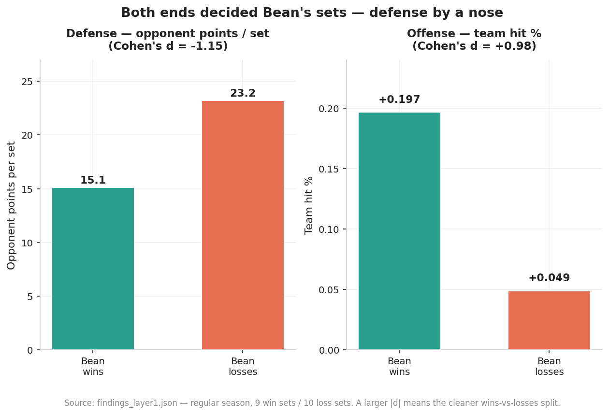

# Bean Machine — anatomy of a volleyball season

A data analysis of my own rec-league volleyball team's 2025-26 winter season —
built end to end from messy, hand-collected data I gathered myself.

**The team:** Bean Machine, team #11 in the Mercer Island Wednesday Men's
Volleyball League. **The season:** 10-11 in the regular season, #1 seed in the
Silver bracket, and Silver bracket champions.

This project asks one question — *why did the season go the way it did?* — and
answers it with a reproducible pipeline that turns two chaotic spreadsheets into
clean data, a ranked set of findings, and the charts below.

---

## TL;DR

- **We earned our record.** A team with our point differential "should" have won
  ~10.05 games by Pythagorean expectation. We won 10. That −0.05 gap was the
  smallest in the 15-team league — our .476 season was neither lucky nor unlucky.
- **We won with both ends of the floor**, defense slightly ahead of offense. In
  sets we won, we held opponents to 15 points; in sets we lost, 23.
- **We peaked at exactly the right time.** Our form was flat for seven regular-
  season weeks, then team hitting efficiency jumped ~80% in the playoff run we
  went on to win.
- **The league's unusual format has a measurable quirk:** because every set is
  scored independently, a third game gets played even when the match is decided —
  and **game 3 is close to a coin flip.**


---

## The project

I play on Bean Machine, and I kept our stats all season. This is portfolio piece
#2 in a move from software engineering into sports analytics — and it's
deliberately the opposite of piece #1 (an NBA series analysis built on clean
public API data). Here the data is messy, real, and mine: I collected most of it
by hand from game footage.

**The league format is unusual and it matters.** Fifteen teams, each match is
best-of-three sets — but *every set counts independently* toward seeding, and
point differential is a tiebreaker. There's no "win the match 2-0 and stop":
teams play the third game even when it can't change who won, because the set
itself still counts. That quirk turns out to be one of the most interesting
things in the data (see [Game 3 is a coin flip](#3-game-3-is-a-coin-flip)).

---

## The roster

Bean Machine ran a tight seven-player rotation all season — no deep bench;
everyone played nearly every set available to them. Roles below are derived from
the stats, not from the position field (which changed game to game).

| Player | Role | The numbers |
|---|---|---|
| **Zane** | Setter | Ran the offense — 138 assists, 74% of the team's total — and was the best server (30% of team aces) |
| **Jeremy** | Outside hitter | Co-leading scorer — 58 kills, +.222 hit% |
| **Andy** | Outside hitter | Co-leading scorer — 57 kills, +.203 hit%; a near-perfect mirror of Jeremy |
| **Cole** | Utility / defensive anchor | Team-high 61 digs; played seven different positions across the season |
| **Cade** | Middle / backup setter | The hybrid — 34 assists *and* 59 digs |
| **Allen** | Opposite hitter | High-usage attacker — 25 kills, but a team-high 32 errors (−.062 season hit%) |
| **Tae** | Middle blocker | Played all 20 of his sets; missed the playoffs with an injury |

Jeremy and Andy were a genuinely balanced two-headed attack — 58 and 57 kills,
+.222 and +.203 efficiency, accounting for over half the team's offense between
them. Zane ran everything from the setter spot.

**The Cole story.** Cole was the team's Swiss army knife. Over 26 sets he lined
up at libero, all three outside-hitter spots, *and* all three middle spots —
seven distinct positions, far more than anyone else. He anchored the defense with
a team-high 61 digs. And when Tae went down injured before the playoffs, Cole
moved permanently to the middle for the championship run — covering a position
that wasn't his, and taking a personal hit for it: his hitting efficiency dropped
from +.229 in the regular season to +.045 in the playoffs as he adjusted. The
team won Silver anyway. (One soft signal, too small to lean on: across the
regular season our best set margins came with Cole at libero — but with only six
sets there, it's a question, not a conclusion.)

---

## The data — and why it was the hard part

The analysis is only as good as the data under it, and the data started rough.
Two source spreadsheets:

- **`league_raw.xlsx`** — every team's schedule and scores. Scores were typed as
  free text by whoever was running the night, with no fixed format:
  `"11 win, 17-25, 25-20, 14-15"`, `"(8 win) 25-19, 25-15"`, `"11w,17-25,..."`,
  `"Tie: 25-20, 20-25"`, `"Both teams won 1 set, no time for third"`.
- **`player_stats_raw.xlsx`** — my own per-player, per-set tracking: attack,
  serving, blocking, digs, serve-receive grades, across ~26 per-game tabs.

**Phase 1 turns that into three clean, validated CSVs** via a five-step pipeline.
The parser is deliberately *hybrid*: regex handles the ~85% of score cells that
follow a recognizable pattern, and anything ambiguous is written to
`data/manual_review/` with the raw text and a best guess, rather than silently
dropped or wrongly parsed. A validation step then cross-checks every join key and
reports coverage and discrepancies in plain English.

That honesty surfaced real things, all documented rather than hidden:

- Our official record (10-11) and our on-court record (9-11 from the cells)
  differ by one game — the league sheet under-recorded a third game, and the
  commissioner awarded us a win. Both views are kept in the data.
- One game (02-18 G3) has no player stats and never will — I don't have footage.
- A `match_id` key collision (two matches per court per week shared an ID) was
  caught *during analysis* and fixed; the validation step now guards against it.

Real franchise data looks like this. Handling it honestly is the point.

---

## What I found

Phase 2 computes findings across three "layers" — inside the team, the league
context, and the league-format hook — plus deep dives on the playoffs, season
trends, player roles, and the two worst losses. Every finding is scored on effect
size, **sample size** (small samples are scored down on purpose), and narrative
interest; the full ranked list is in
[`data/processed/findings_summary.md`](data/processed/findings_summary.md).

A blunt caveat up front: **the samples are small** — 19 regular-season sets with
complete data, 6 playoff sets, 7 weekly data points. These findings are honest
descriptions of what the data shows, not laws. Correlation is never causation.

### 1. We earned our record

Pythagorean expectation estimates how many games a team *should* win from its
point differential. Across the league it exposed some big gaps between luck and
merit — Volley These Balls went 11-0 on a profile worth ~7 wins (the luckiest
team), Tape Ticklers won 3 on a profile worth ~7 (the unluckiest).

Bean Machine? Expected 10.05, won 10. The smallest gap of any team. Our .476 was
exactly what our play deserved. (Chart at the top of this README.)

### 2. Defense edged offense

Splitting our sets into wins and losses, both ends of the floor separated cleanly
— but defense by a nose. In sets we won we held opponents to 15.1 points; in sets
we lost, 23.2 (Cohen's d = −1.15). Our hitting efficiency split too (d = +0.98).
Both effects are large; the honest summary is "both mattered, defense slightly
more."



### 3. Game 3 is a coin flip

This is the finding only this league's format makes possible. In games 1 and 2
the better team (by record) won ~72-74% of the time. In game 3 — the same teams,
same night — that dropped to **53%**, barely above a coin flip. Game-3 margins
were also significantly tighter (mean 3.6 points vs 5.4 and 6.1; Welch p < 0.02).


Part of it is selection (close matches are the ones that reach a third game),
part is the shorter cap (to 15, not 25) adding variance. And there's a behavioral
twist: although every set officially counts for seeding, teams largely *opted out*
of meaningless game 3s — when a match was already 2-0, a third game was played
only 2 times out of ~27; when it was 1-1, 17 times out of ~27.

### 4. The Allen story

The most striking individual pattern. Allen's attack efficiency tracked the
team's results almost perfectly: in the regular season he hit +.024 in sets we
won versus −.189 in sets we lost — a 21-point swing, the largest on the roster.
Then in the playoffs he flipped a −.10 regular-season hit% to **+.20**. The
player whose efficiency most mirrored the team had his best volleyball when it
mattered most.


(This is correlation, not causation — the data can't say whether his swings drove
results or the situations drove his swings. But the pattern is real.)

### 5. We peaked for the playoffs

Our regular season showed *no* significant week-to-week improvement — if
anything, set margin drifted slightly down over the seven weeks. Then the playoff
run broke trend entirely: team hit% jumped from +.121 to +.217 (~80%), digs rose
26%, aces 50%. The championship wasn't a slow build; it was a step change. The
lineup also crystallized — with Tae out injured, Cole moved to middle to cover
him and every player settled into one fixed role.


### 6. The 01-07 paradox

The single cleanest illustration of why this league scores every set
independently. On January 7th we *lost* the match to Raw Butt Sets, one set to
two — 24-26, 26-15, 2-6 — yet **outscored them 52-47 across the night**. One
blowout set win between two narrow losses. Match results and seeding genuinely
diverge here.


### Context: the Silver bracket

Winning Silver is a real result, and it's worth being honest about what it was.
The league's two brackets reflected a true talent gap — Gold teams averaged a 67%
win rate, Silver teams 31%. Bean Machine (.476) was the strongest team in Silver,
which is why we were the #1 seed. We won the top half of the league's lower half.


---

## How it's built

Three phases, each reproducible with one command. First-time setup:

```
make venv      # create .venv and install dependencies
```

Then:

```
make data      # Phase 1 — parse raw .xlsx into clean, validated CSVs
make analysis  # Phase 2 — compute findings → data/processed/findings_*.json
make charts    # Phase 3 — render the 8 charts → charts/
make all       # all of the above, end to end
```

**Phase 1 — data layer** (`src/01`–`05`): extract spreadsheet tabs, parse the
free-text scores (hybrid regex + manual review), build the Bean-perspective
tables, and validate every join.

**Phase 2 — analysis** (`src/10`–`17`, then `13`): the three analysis layers plus
the deep dives, each emitting a structured `findings_*.json`; `13_synthesize.py`
ranks them all into `findings_summary.md`.

**Phase 3 — charts** (`src/20`–`22`): the eight figures above, sharing one
styling helper for a consistent look.

---

## Honest caveats

- **Small samples throughout.** 19 regular-season sets with complete data, 6
  playoff sets, 7 weekly points. Findings are directional, not definitive — and
  each one in `findings_summary.md` carries an explicit sample-size score.
- **Correlation is not causation.** The Allen story, the offense/defense split,
  and the stat correlations describe what *tracked* with winning, not what caused
  it.
- **Pythagorean expectation** is well validated in basketball and baseball, less
  so for volleyball at the set level. It's used here as a reasonable lens.
- **Known data gaps** are documented, not hidden: one game has no player stats,
  most playoff set scores were never recorded, and the official vs on-court record
  differ by one game. See the Phase 1 validation output.

---

## Repo structure

```
data/
  raw/            two source .xlsx files (+ a manual playoff-scores CSV)
  processed/      the clean CSVs, findings_*.json, and findings_summary.md
  manual_review/  score cells the parser flagged for a human
src/
  01–05_*.py      Phase 1 — data pipeline
  10–17_*.py, 13  Phase 2 — analysis
  20–22_*.py      Phase 3 — charts
  chart_style.py  shared chart styling
charts/           the 8 rendered figures
Makefile          one-command reproduction of every phase
PHASE2_NOTES.md   detailed analysis notes and decisions
```

---

## Source data

The `.xlsx` files in `data/raw/` are exports of two Google Sheets maintained
through the season:

- League schedule and scores —
  [Google Sheet](https://docs.google.com/spreadsheets/d/1fUR2kJy3ZEeiIz9mfyUbWO2I-rPgxGcQ44nToddjqaE/edit?usp=sharing)
- Bean Machine per-player stats —
  [Google Sheet](https://docs.google.com/spreadsheets/d/1Mk5XCqo7_MVq0_m-4yvjRVieMh7UwWcEXsp1RCRQ-Oc/edit?usp=sharing)

Game footage (the source for the player stats) is on YouTube:
[@cadetanaka7543](https://www.youtube.com/@cadetanaka7543).
